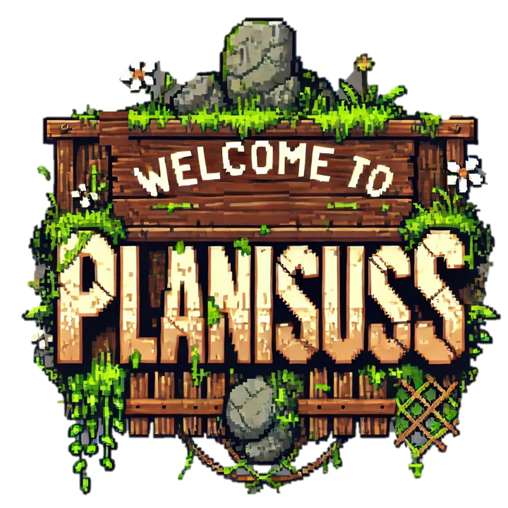

**Planisuss**

*Computer programming, Algorithms and Data str., Mod. 1 – Bachelor's in Artificial Intelligence, UniPv, UniMi, UniMib*

---

Welcome to Planisuss... a simulation of an ecosystem where every creature makes decisions, forms alliances, and battles for survival, it contains three main species:

- ## **Vegetob**

A vegetable species. Its density starts around 25 and they spontaneously grow on the ground with a max density of 200. They are also reduced each day because of the grazing effect of Erbasts in the cells, as Vegetob are the main source of food for the Erbasts providing them with an increase in energy.

## **Animal Species:**

- ## **Erbasts**
A herbivore species, who wonder the land in search of food and safety. 

Their behavior is both strategic and adaptive. Erbasts constantly evaluate their surroundings, scoring neighboring cells based on several factors. They consider the presence of predators, the size of nearby groups, and food availability to decide their next move. When they sense the presence of danger from nearby Carviz (carnivores) they quickly change their course setting a preferred escape direction.

They are also able to form social groups named Herds. Once an Erbast has joined a Herd they obtained several advantages: 
   - Knowledge about past visited cells.
   - Knowledge about predators.
   - In a Herd you have multiple eyes hence you'll be able to identify dangers at a longer distance.

- ## **Carviz**
A carnivore species, with a singular mission: *Hunting*

Carviz carefully scan the environment, focusing on areas with a high concentration of Erbasts. Their desirability scores prioritize cells where their next meal might be hiding.

Carviz can also band together to form Prides. In a Pride, the group’s combined intelligence and coordinated movement allow them to track down prey more effectively. However, if individual instincts diverge too much from the group’s strategy, some Carviz might break off and choose a different path.

## **Behind The Simulation**
We aim to explore the emergent behaviors driven by individual decisions and social dynamics.

- **Dynamical Decision Making**
    Each animal examines its local environment within a defined radius (the “neighborhood”). The score for each cell is calculated by combining factors like predator presence, group size (or potential for social grouping), food density, and current energy levels, of course we had to add an stochastic element in order to simulate more natural behaviors.

- **Social Interactions**
    Herds and Prides are not only simple social groups, they are able to share experiences and resources (e.g. energy), thus creating a balance between individual choice and the collective.

- **Reproduction Dynamics**
    When an animal reaches the end of its lifespan it is able to reproduce generating two new offsprings inheriting some traits from its parent. Their start a new life with their own energy and social attitude.

- **Resource Balances**
    There is an ongoing balance between the growth and decay of the species, cooperation and survival that challenges our little species to strategize in order to thrive.

---
Try out Planisuss to test a new journey trough a small ecosystem where you can experience and test the strategic choices of our animals while they interact with each other and the environment.

**A small showcase:** https://youtu.be/STb9Xr_yvms
